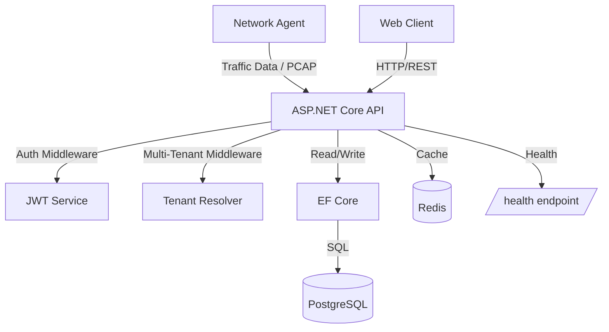
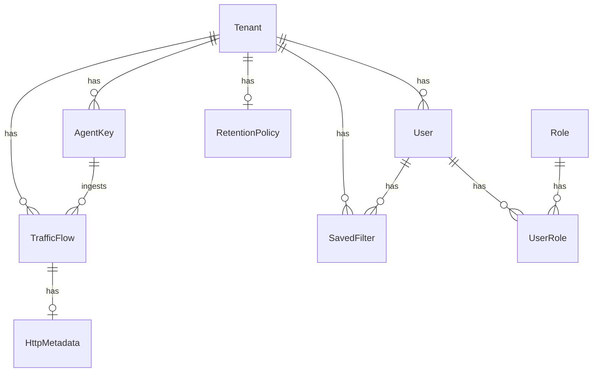

# VoidPulse Architecture Guide

## System Overview

VoidPulse is a multi-tenant network traffic monitoring system. Network agents deployed across infrastructure collect traffic flow data and send it to the VoidPulse API for storage, analysis, and visualization. The system supports multiple tenants with strict data isolation, role-based access control, and configurable data retention policies.

### High-Level System Diagram



### Key Components

| Component | Technology | Purpose |
|-----------|-----------|---------|
| API Gateway | ASP.NET Core Web API | REST endpoints, authentication, request routing |
| Database | PostgreSQL 16 | Persistent storage for all entities |
| Cache | Redis 7 | Dashboard result caching, rate limiting counters |
| Auth | JWT + BCrypt | Token-based authentication, password hashing |
| ORM | Entity Framework Core | Database access, migrations, query building |
| Logging | Serilog | Structured JSON logging with correlation IDs |

## Clean Architecture

The backend follows Clean Architecture (also known as Onion Architecture), organized into four layers with strict dependency rules.

```
┌──────────────────────────────────────────┐
│              VoidPulse.Api               │  ← API Layer (Controllers, Middleware)
├──────────────────────────────────────────┤
│         VoidPulse.Infrastructure         │  ← Infrastructure (EF Core, Redis, JWT)
├──────────────────────────────────────────┤
│          VoidPulse.Application           │  ← Application (Services, DTOs, Validators)
├──────────────────────────────────────────┤
│            VoidPulse.Domain              │  ← Domain (Entities, Interfaces, Exceptions)
└──────────────────────────────────────────┘
```

### Dependency Rules

- **Domain** has zero external dependencies. It defines entities, repository interfaces, and domain exceptions.
- **Application** depends only on Domain. It contains service interfaces, DTOs, business logic services, validators, and mapping profiles.
- **Infrastructure** depends on Domain and Application. It implements repositories (EF Core), JWT service, password hashing, and Redis caching.
- **API** depends on Application. It registers Infrastructure services via dependency injection, contains controllers and middleware.

### Layer Responsibilities

**Domain Layer** (`VoidPulse.Domain/`)
- Entity definitions: `BaseEntity`, `Tenant`, `User`, `Role`, `UserRole`, `TrafficFlow`, `HttpMetadata`, `AgentKey`, `RetentionPolicy`, `SavedFilter`
- Repository interfaces: `IRepository<T>`, `IUserRepository`, `ITenantRepository`, `ITrafficFlowRepository`, `IAgentKeyRepository`, `IRetentionPolicyRepository`, `ISavedFilterRepository`
- Domain exceptions: `DomainException`, `NotFoundException`, `UnauthorizedException`

**Application Layer** (`VoidPulse.Application/`)
- Service interfaces and implementations for each domain area
- Request/Response DTOs organized by feature
- FluentValidation validators for request DTOs
- AutoMapper profile for entity-to-DTO mapping
- Common types: `ApiResponse<T>`, `PagedResult<T>`, `ApiError`, `FieldError`

**Infrastructure Layer** (`VoidPulse.Infrastructure/`)
- `AppDbContext` with entity configurations and global query filters
- Repository implementations using EF Core
- `JwtService` for token generation and validation
- `BcryptPasswordHasher` for secure password hashing
- `RedisCacheService` for caching operations

**API Layer** (`VoidPulse.Api/`)
- REST controllers for each feature area
- `ExceptionMiddleware` for global error handling
- `CorrelationIdMiddleware` for request tracing
- `TenantMiddleware` for multi-tenant context resolution
- `ServiceCollectionExtensions` for DI configuration

## Entity Relationship Diagram



### Entity Details

All entities inherit from `BaseEntity`, which provides:
- `Id` (Guid): Primary key, auto-generated
- `CreatedAt` (DateTime): UTC timestamp, set on creation
- `UpdatedAt` (DateTime): UTC timestamp, updated on every change
- `DeletedAt` (DateTime?): Nullable, used for soft deletes

**Core Entities:**
- **Tenant**: Organization unit. Has a unique `Slug` for URL-safe identification.
- **User**: Belongs to a Tenant. Stores `PasswordHash`, `RefreshToken`, and `LastLoginAt`.
- **Role**: System-wide roles (SuperAdmin, TenantAdmin, Analyst, Viewer). Seeded at startup.
- **UserRole**: Many-to-many join between User and Role.
- **AgentKey**: API key for network agents. Bound to a Tenant.
- **TrafficFlow**: Core data entity. Records a single network flow with source/destination IPs, ports, protocol, and byte/packet counts.
- **HttpMetadata**: Optional HTTP-layer details attached to a TrafficFlow (method, host, path, status code, response time).
- **RetentionPolicy**: One per tenant. Defines how many days of traffic data to retain (default 90).
- **SavedFilter**: User-created filter presets stored as JSON, scoped to user and tenant.

## Authentication Flow

```
┌────────┐                          ┌─────────┐                    ┌──────────┐
│ Client │                          │   API   │                    │    DB    │
└───┬────┘                          └────┬────┘                    └────┬─────┘
    │  POST /auth/login                  │                              │
    │  { email, password }               │                              │
    ├───────────────────────────────────>│                              │
    │                                    │  Find user by email          │
    │                                    ├─────────────────────────────>│
    │                                    │  User record                 │
    │                                    │<─────────────────────────────┤
    │                                    │                              │
    │                                    │  Verify BCrypt hash          │
    │                                    │  (cost factor 12)            │
    │                                    │                              │
    │                                    │  Generate JWT access token   │
    │                                    │  (15 min expiry, contains    │
    │                                    │   UserId, TenantId, Roles)   │
    │                                    │                              │
    │                                    │  Generate refresh token      │
    │                                    │  (7 day expiry, stored in DB)│
    │                                    │                              │
    │  { accessToken, refreshToken,      │  Store refresh token         │
    │    user }                          ├─────────────────────────────>│
    │<───────────────────────────────────┤                              │
    │                                    │                              │
    │  GET /traffic (Bearer token)       │                              │
    ├───────────────────────────────────>│                              │
    │                                    │  Validate JWT signature      │
    │                                    │  Extract UserId, TenantId    │
    │                                    │  Check role authorization    │
    │                                    │  Apply tenant filter to query│
    │                                    ├─────────────────────────────>│
    │  { traffic data }                  │                              │
    │<───────────────────────────────────┤                              │
```

### Token Details

- **Access Token**: JWT signed with HMAC-SHA256. Contains claims: `sub` (UserId), `tenant_id` (TenantId), `role` (Roles). Expires in 15 minutes.
- **Refresh Token**: Cryptographically random base64 string stored in the User record. Single-use with rotation -- each refresh issues a new refresh token and invalidates the old one. Expires in 7 days.
- **Agent API Key**: Separate authentication path for traffic ingestion. Passed via `X-Api-Key` header. Stored in the AgentKey table.

## Request Lifecycle

Every HTTP request passes through the following middleware pipeline:

1. **CorrelationIdMiddleware** -- Generates or reads an `X-Correlation-Id` header, pushes it to the Serilog log context for distributed tracing.

2. **ExceptionMiddleware** -- Catches all unhandled exceptions, maps them to standard `ApiResponse` error format:
   - `NotFoundException` -> 404
   - `UnauthorizedException` -> 401
   - `DomainException` -> 400
   - Any other exception -> 500

3. **CORS Middleware** -- Validates request origins against configured `CORS__AllowedOrigins`.

4. **Authentication Middleware** -- Validates JWT Bearer tokens, populates `HttpContext.User` with claims.

5. **Authorization Middleware** -- Checks role-based policies (`SuperAdmin`, `TenantAdmin`, `Analyst`, `Viewer`).

6. **Controller** -- Extracts tenant/user context from claims, delegates to Application services.

7. **Application Service** -- Executes business logic, calls repositories and cache.

8. **Repository** -- Translates to EF Core queries with automatic `TenantId` filtering via global query filters.

## Multi-Tenancy Design

VoidPulse uses the **shared database, shared schema** multi-tenancy pattern with a `TenantId` discriminator column:

- Every tenant's data lives in the same PostgreSQL database and tables.
- Entities that require tenant isolation include a `TenantId` foreign key column.
- EF Core global query filters automatically append `WHERE TenantId = @tenantId` to all queries.
- The `TenantMiddleware` extracts the `TenantId` from JWT claims and makes it available via `ICurrentUserService`.
- Controllers pass `TenantId` to services, which pass it to repositories.
- **SuperAdmin** role bypasses tenant filtering for cross-tenant operations.

### Advantages

- Simple deployment: single database instance
- Easy tenant provisioning: just insert a Tenant row
- Shared schema reduces operational overhead

### Considerations

- Requires careful index design to include `TenantId` for query performance
- All queries must include tenant context to prevent data leakage
- Noisy-neighbor risk is mitigated by connection pooling and rate limiting

## Key Design Decisions

### Clean Architecture

The codebase follows Clean Architecture to achieve separation of concerns and testability. Domain entities have no dependency on EF Core or any framework. Application services are tested with mocked repositories. Infrastructure implementations can be swapped without changing business logic.

### Soft Delete

All entities support soft delete via a nullable `DeletedAt` column. EF Core global query filters automatically exclude soft-deleted rows. This supports:
- Data retention compliance
- Audit trail preservation
- Easy recovery of accidentally deleted data

### Standard API Response Envelope

Every endpoint returns a consistent `ApiResponse<T>` wrapper with `success`, `data`, `error`, and `meta` fields. This simplifies client-side error handling and provides a predictable contract.

### Structured Logging

Serilog with JSON structured output and correlation ID propagation enables effective log aggregation and distributed tracing across horizontally scaled API instances.

### Redis Caching

Dashboard endpoints cache results in Redis with a 60-second TTL. This prevents expensive aggregation queries from hitting the database on every request. Cache keys include the tenant ID and period to ensure tenant isolation.

### Agent API Key Authentication

Network agents authenticate using API keys (passed via `X-Api-Key` header) rather than JWT tokens. This is more practical for long-running agent processes that should not need to handle token refresh flows.
